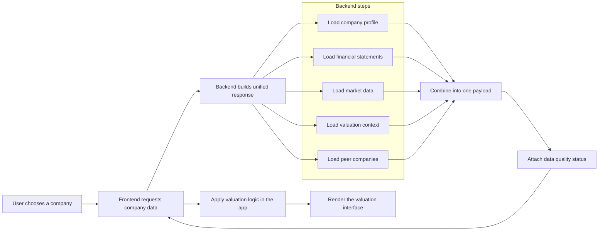
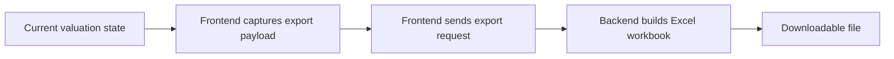

# DCF Builder Architecture Flow

This document explains how the main valuation workflow is assembled and where the core responsibilities sit.

The project has a simple division of labor:

- the backend gathers and prepares data
- the frontend turns that data into an interactive valuation workspace

## Primary Valuation Load

## What the Main Company Response Contains

When the app loads a company, it tries to return one response containing:

- company profile
- financial statements
- market data
- valuation context
- peer companies
- quality and status metadata

That design keeps the frontend from needing to make too many separate calls for the initial valuation screen.

## Optional Data

Some data improves the experience but is not required for the first screen to load.

Examples:

- peer companies
- insider trades

If that data is missing, the app should still load the core valuation workflow.

## Export Flow

The export is based on the numbers currently active in the application state.

## Data Quality Status

The backend tells the frontend how complete or trustworthy a given data segment is. That allows the frontend to distinguish between fresh data, cached data, defaults, and unavailable sections.

Common status values:

- `live`: fresh upstream data
- `cached`: previously saved data
- `stale`: older cached data
- `default`: safe fallback value
- `unavailable`: data could not be loaded

These values are mainly useful for debugging, reliability work, and contributor understanding.

## Where Failures Usually Happen

Common weak points include:

- invalid ticker input
- incomplete SEC data
- missing market price data
- fallback macro values
- peer lookup timeouts

The backend is designed to return the best usable result available and make degraded data visible instead of failing silently.

## Responsibility Split

### Frontend responsibilities

- company search
- page navigation
- user inputs and assumption changes
- valuation logic shown in the UI
- tables, charts, and export trigger

### Backend responsibilities

- fetch company profile and financials
- fetch market data and valuation context
- enrich or choose peer companies
- track data quality and completeness
- cache responses
- generate Excel output

## Main Upstream Sources

- `edgartools`: primary source for SEC-native company profile and financial statements
- `stockdex`: primary market data source
- Yahoo Finance: fallback market data source

## Where to Go Next

- Use [README.md](../README.md) for the project overview
- Use [LOCAL_SETUP.md](LOCAL_SETUP.md) for installation
- Use [API_DOCS.md](API_DOCS.md) for route details
